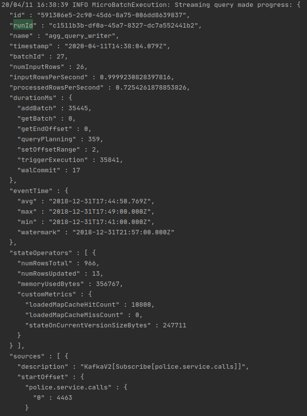
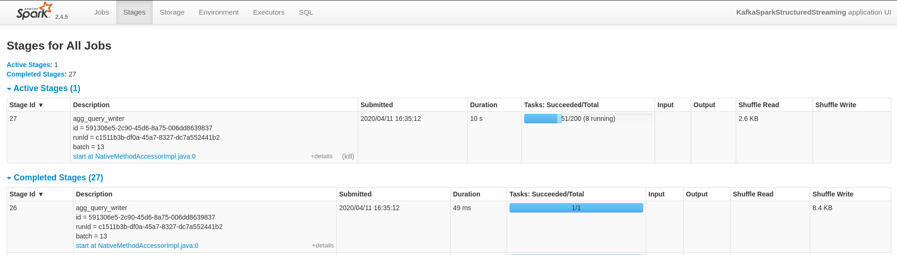

# sf-crime-data
sf-crime-data Project from Udacity

## Requirements
* Python 3.7+
* pip/anaconda

## Setup Local Environment
* install the requirements, e.g. in a venv with:
```
pip install -r requirements.txt
```
* Use the commands below to start the Zookeeper and Kafka servers. You can find the bin and config folder in the Kafka binary that you have downloaded and unzipped.
```
bin/zookeeper-server-start.sh config/zookeeper.properties
bin/kafka-server-start.sh config/server.properties
```
* You can start the bootstrap server using this Python command: `python producer_server.py`

## Step 1
* The first step is to build a simple Kafka server.
* Complete the code for the server in `producer_server.py` and `kafka_server.py`.
#### Local Environment
* To see if you correctly implemented the server, use the command `bin/kafka-console-consumer.sh --bootstrap-server localhost:<your-port-number> --topic <your-topic-name> --from-beginning` to see your output.

Take a screenshot of your kafka-consumer-console output. You will need to include this screenshot as part of your project submission.


## Step 2
* Apache Spark already has an integration with Kafka brokers, so we would not normally need a separate Kafka consumer. However, we are going to ask you to create one anyway. Why? We'd like you to create the consumer to demonstrate your understanding of creating a complete Kafka Module (producer and consumer) from scratch. In production, you might have to create a dummy producer or consumer to just test out your theory and this will be great practice for that.
* Implement all the TODO items in `data_stream.py`. You may need to explore the dataset beforehand using a Jupyter Notebook.
* Do a spark-submit using this command: 
```
spark-submit --packages org.apache.spark:spark-sql-kafka-0-10_2.11:2.3.4 --master local[*] data_stream.py
```
Update: changed the version locally to make it run:
``` 
spark-submit --packages org.apache.spark:spark-sql-kafka-0-10_2.11:2.4.4 --master local[*] data_stream.py
```
* Take a screenshot of your progress reporter after executing a Spark job. You will need to include this screenshot as part of your project submission.

* Take a screenshot of the Spark Streaming UI as the streaming continues. You will need to include this screenshot as part of your project submission.

## Step 3
Write the answers to these questions in the README.md doc of your GitHub repo:

1. How did changing values on the SparkSession property parameters affect the throughput and latency of the data?
    * Comparing with these 3 values as default with 200 "maxOffsetsPerTrigger":
        * "numInputRows" : 200,
        * "inputRowsPerSecond" : 24.88490730372029,
        * "processedRowsPerSecond" : 28.82259691598213,
    * setting "maxOffsetsPerTrigger" from 200 to 2000 
      * "numInputRows" : 2000,
      * "inputRowsPerSecond" : 188.53695324283558,
      * "processedRowsPerSecond" : 239.72192256981901,
    * setting "maxOffsetsPerTrigger" from 200 to 100 
      * "numInputRows" : 100,
      * "inputRowsPerSecond" : 5.914709883480215,
      * "processedRowsPerSecond" : 8.300821781356355,
   
    * tuning the offsetPerTrigger can affect the throughput - a huger number of input rows seems to increase the throughput, since the batches are bigger.
 
2. What were the 2-3 most efficient SparkSession property key/value pairs? Through testing multiple variations on values, how can you tell these were the most optimal?
    * maxOffsetsPerTrigger -> see first answer
    * spark.memory.fraction according to: https://spark.apache.org/docs/latest/tuning.html but seems not have much affect on small batches of 200 rows
      * setting it to 50
        * "numInputRows" : 200,
        * "inputRowsPerSecond" : 14.571948998178506,
        * "processedRowsPerSecond" : 21.94426157559798,
      * setting it to 1000 
        * "numInputRows" : 200,
        * "inputRowsPerSecond" : 21.8435998252512,
        * "processedRowsPerSecond" : 14.867677668748142,
      * setting it to 500
        * "numInputRows" : 200,
        * "inputRowsPerSecond" : 17.452006980802793,
        * "processedRowsPerSecond" : 18.684603886397607,
    * spark.default.parallelism according to: https://spark.apache.org/docs/latest/tuning.html seems to vary the processing a lot:
      * setting it to 10:
        * "numInputRows" : 200,
        * "inputRowsPerSecond" : 42.78990158322635,
        * "processedRowsPerSecond" : 31.565656565656564,
      * setting it to 1:
        * "numInputRows" : 200,
        * "inputRowsPerSecond" : 23.84642899725766,
        * "processedRowsPerSecond" : 39.960039960039964,

      
## Project Submission
You will submit a link to your GitHub repo, with the files you've created: `producer_server.py, kafka_server.py, data_stream.py`, and `consumer_server.py`. The `README.md` doc in your GitHub repo should contain your responses to the two questions from Step 3.

Your project submission should also include a zip file containing the three screenshots you've taken.
##License
MIT License

Copyright (c) 2020 Thomas Andre

Permission is hereby granted, free of charge, to any person obtaining a copy
of this software and associated documentation files (the "Software"), to deal
in the Software without restriction, including without limitation the rights
to use, copy, modify, merge, publish, distribute, sublicense, and/or sell
copies of the Software, and to permit persons to whom the Software is
furnished to do so, subject to the following conditions:

The above copyright notice and this permission notice shall be included in all
copies or substantial portions of the Software.

THE SOFTWARE IS PROVIDED "AS IS", WITHOUT WARRANTY OF ANY KIND, EXPRESS OR
IMPLIED, INCLUDING BUT NOT LIMITED TO THE WARRANTIES OF MERCHANTABILITY,
FITNESS FOR A PARTICULAR PURPOSE AND NONINFRINGEMENT. IN NO EVENT SHALL THE
AUTHORS OR COPYRIGHT HOLDERS BE LIABLE FOR ANY CLAIM, DAMAGES OR OTHER
LIABILITY, WHETHER IN AN ACTION OF CONTRACT, TORT OR OTHERWISE, ARISING FROM,
OUT OF OR IN CONNECTION WITH THE SOFTWARE OR THE USE OR OTHER DEALINGS IN THE
SOFTWARE.
